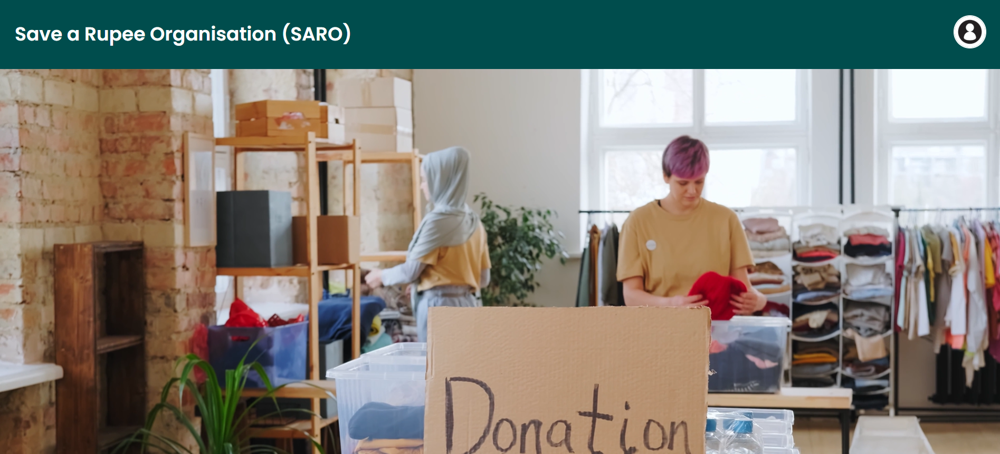
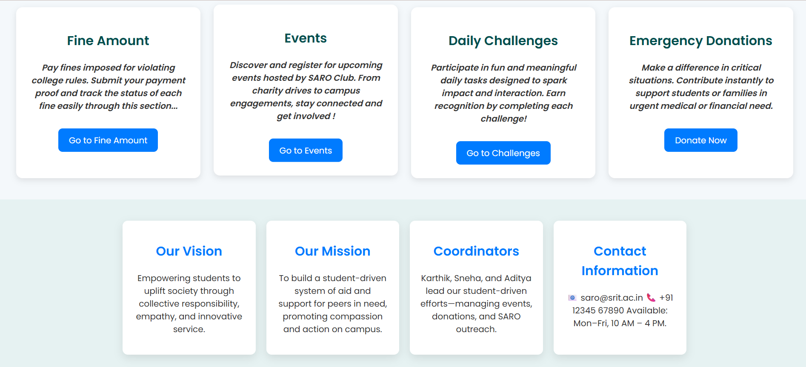
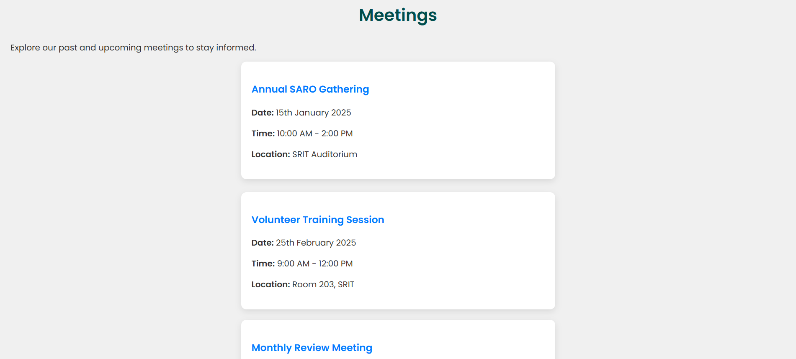
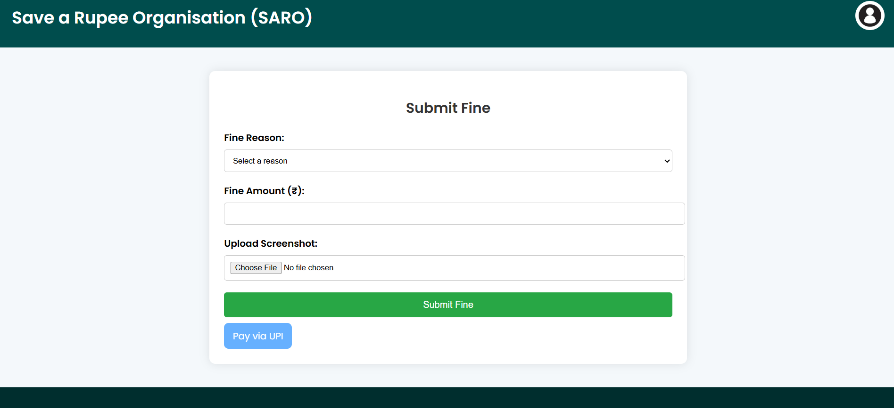
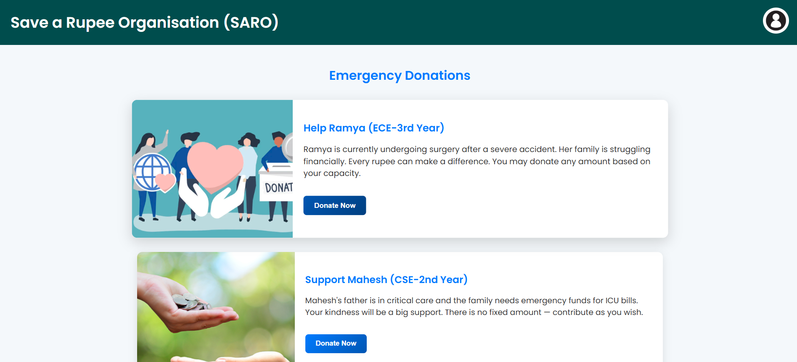
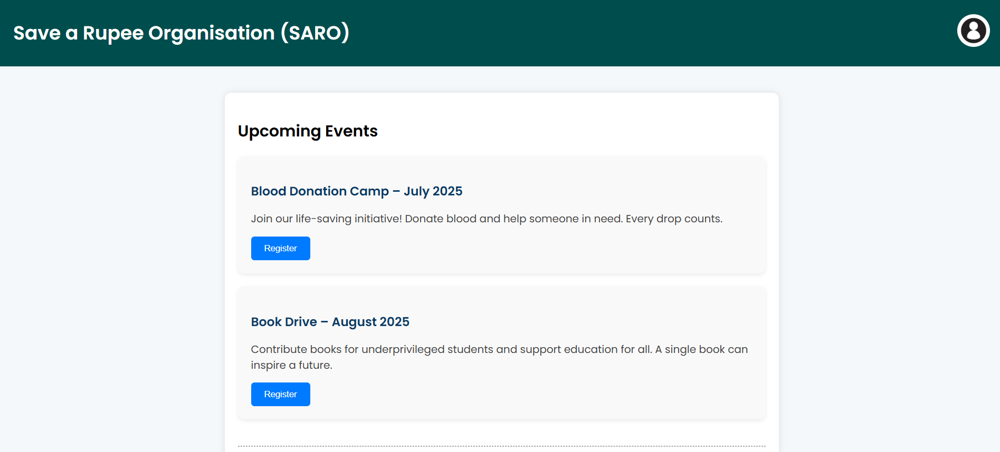
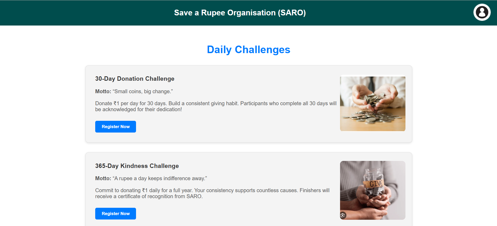
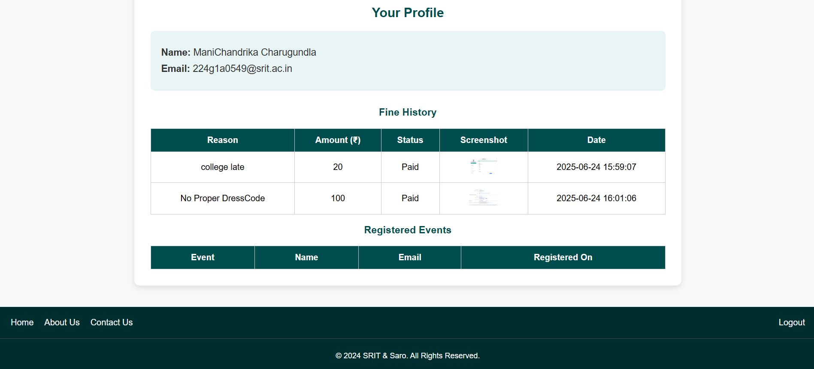

# 💸 SaroHub – Where Every Donation Makes a Difference

A student-led donation and event management platform built for **SRIT's SARO Club**, enabling students to:

- Donate to emergency cases
- Pay fines online with proof
- Register for events and get confirmation via email
- Take part in ₹1 donation challenges
- Track their activity via a profile dashboard

---

## 🔥 Key Features

- 🩺 **Emergency Donations**  
  Help students in urgent medical or financial need. UPI-based donations – give any amount you can.

- 📥 **Fine Submissions**  
  Students can submit fines with payment screenshots for verification.

- 📅 **Event Registration**  
  Register for upcoming events and see past events. Confirmations sent by email.

- 💪 **Daily ₹1 Challenges**  
  Join 30/365-day donation challenges. Get recognized for consistency.

- 🧾 **Student Dashboard**  
  View submitted fines and your registered events after login.

---

## 🛠 Tech Stack

| Layer     | Technology                            |
|-----------|----------------------------------------|
| Frontend  | HTML, CSS, Bootstrap, JavaScript       |
| Backend   | PHP                                     |
| Database  | MySQL                                   |
| Email     | PHPMailer with Gmail SMTP              |
| Hosting   | InfinityFree / XAMPP                   |

---

## 📁 Folder Structure

```
SAROHub/
│
├── css/              → Stylesheets  
├── images/           → Event & UI images  
├── javascript/       → Client-side scripts  
├── php/              → Backend logic (fines, registration)  
├── phpmailer/        → PHPMailer library  
├── db/     → Database file  
├── *.php / *.html    → Main pages (home, events, login, register, etc.)  
```

---

## 🗂 Database Setup

1. Create a MySQL database named `saro_hub`.
2. Import `saro_hub.sql` using **phpMyAdmin** or command line:

```bash
mysql -u root -p saro_hub < saro_hub.sql
```

---

## 🚀 Live Demo

🔗 [View Live Project](https://your-deployed-link.com)  

---

## 📸 Screenshots

### 🏠 Home Page Overview


### 🎯 Mission, Vision & Features


### 📆 Meetings Section


### 💸 Fine Submission


### 🆘 Emergency Donations


### 📅 Events


### 💪 ₹1 Donation Challenges


### 👤 Profile Dashboard



---

## 🙋‍♀️ About SARO

**Save A Rupee Organisation (SARO)** is a student-run initiative at SRIT that supports peers during emergencies through micro-donations, social work, and transparent contributions.

> “We rise by lifting others.”

---

## 🧠 Author

👩‍💻 Developed with ❤️ by [Mani Chandrika](https://github.com/mani-chandrika549)

⭐ Star this repo if you found it helpful!

---

## 📌 Note

Only SRIT students with a `@srit.ac.in` email can register or log in to the platform.


